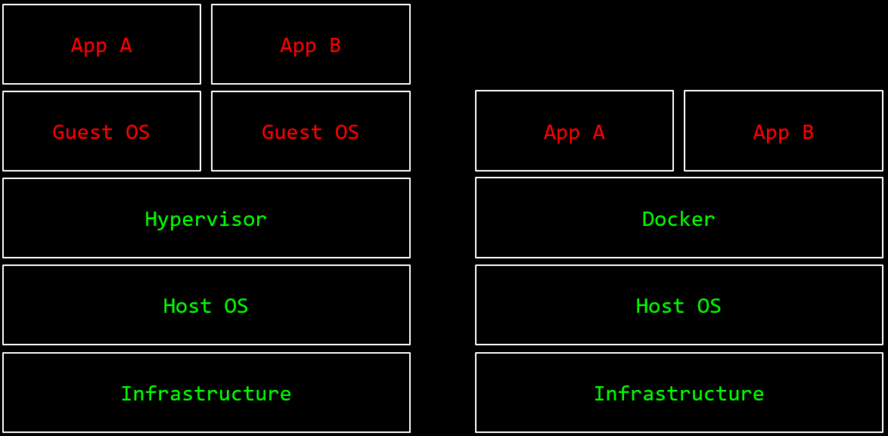

Exam: Reading Material - extended response style questions, and refer to Agile table

- Agile vs Waterfall

  - Tighter Agile sprint iterations

    - | Phase       | Inputs                        | Outcomes              |
      | ----------- | ----------------------------- | --------------------- |
      | Backlog     | Developer training            | Security prioritised  |
      | Design      | Secrets management            | Secure persistency    |
      | Development | Software composition analysis | Secure dependencies   |
      | Testing     | Static & dynamic analysis     | Fix bugs              |
      | Deployment  | Containerisation, hardening   | Defence in depth      |
      | Review      | Root cause analysis           | Bug class eradication |

- Developer training (less costly to find vulns earlier) vs design phase security

- Secrets management

  - Secrets loaded into memory
  - Encryption not very useful?
  - Use password vaults

- OVAL & NIST NVD

  - Common vulnerability enumeration (CVE)
    - Only assigned to software you can run on your own system (not cloud)
    - Scope - widely used in America
    - Maybe no longer be supported
  - CWE (Vulnerability Taxonomy) - weaknesses
  - CVSS (Risk Rating) - score
  - CPE (What is vulnerable?) - platforms

- Software composition analysis

  - NVD CPE identifies known vulnerable versions
  - Package metadata identifies version used
  - SCA tool attempts to match the two and identify known vulnerabilities
  - springframework vs spring core different naming example
  - Can be integrated in Agile -> code runners, dependency checks

- Source code analysis

  - Static application security testing
    - Grepstrings
    - Sources, sinks & taints
    - Find & fix vulns early, but may be false positive
  - Dynamic application security testing (DAST)
    - Fuzzing (AFL) - less about vulnerability management
    - Scan live targets, but data corruption, can't read config files, relies on configuration to map attack surface (define perimeter, domain name filtering etc.)
  - Hybrid - agent in runtime (code level and live requests)

- Deployment (operational phase)

  - Virtualisation vs Containerisation
    - 
    - Virtualisation
      - Hypervisor: VMWare, KVM (ring 0), Parallels etc. -> kernel security to protect Guest OS from each other
      - Slow performance - separate kernel per guest - stack and overhead - Guest OS virtual memory complexities
      - Doesn't scale well
    - Containerisation
      - Packages dependencies and runtime information -> allows for native execution on Host OS
      - "Containers don't contain" - vulnerability
        - RunC: "low level" container runtime used by "high level" container runtimes such as Docker - used to spawn and run containers (parent process)
        - procfs (mounted to /proc): virtual Linux file system that presents info about processes - interface to system data that the kernel exposes as a filesystem.
          - /proc/self/exe - symlink to executable file the process is running
          - /proc/self/fd - directory containing the file descriptors open by the process
        - Attackers can trick runC into executing itself by asking it to run /proc/self/exe (symlink to runC binary on host)
        - If they have root access in the container, they can use /proc/[runc-pid]/exe as a reference to the runC binary (owned by root) on the host and overwrite it
        - Next time runC is executed -> attacker will achieve code execution on the host
        - Since runC is normally run as root (e.g. by the Docker daemon), the attacker will gain root access on the host
      - docker-bench-security - audits host running Docker
        - Make sure Docker socket not mounted
      - DevSecOps people to manage SCA inside containerised payloads

Continuous integration / delivery / deployment

- Continuous delivery vs continuous deployment - "deploy to production" stage manual rather than automatic
- CI/CD automated checks from development to production - automate DevSecOps

Readings

- [Find-sec-bugs](https://find-sec-bugs.github.io/)
  - SpotBugs plugin for security audits of Java web applications
  - Bug patterns (with references to OWASP Top 10 and CWE)
  - Uses WASC threat classification
- [Tracking vulnerable JARs](https://www.slideshare.net/davidjorm/tracking-vulnerable-jars)
  - Java applicationss rely on a large number of libraries (dependencies), and bundles its own dependencies - statically compiled and not dynamically linked
  - Maven for compiled JARs as dependencies
    - Aspect Security 2012 study showed that 29.8 million (26%) of library downloads contained known flaws
    - App developers should instead:
      - Provide tailored security policies that can be leveraged by the Java Security Manager to ensure limited impact of any exposure
      - Enforce scans of dependencies against a known vulnerability DB (map dependencies to CVEs)
      - Internalise and self manage Maven repositories to ensure absolute control of dependencies
  - JBoss products are bundled with all dependent JARs, rather than using a dependency management system
    - Collate and recursively unpack all released/engineering product builds to generate a complete manifest database cataloging the JARs used by each build, and match this db against a db of known vulnerable JARs. Perform a check against the db at build time.
    - Requires jboss-manifest (JAR manifest generator which recursively unpacks projects distribued as zip files to generate a text and SQL-based manifest of their packaged JARs), victims db (db of known vulnerable JARs identified by sha-512 fingerprints and linked to CVE IDs) and enforce-victims rule (detect known-vulnerable JARs at build time based on the victi.ms database)
    - Jar file within archives include info about file itself, contents of META-INF/MANIFEST.MF, the signer information in META-INF/*.DSA/RSA, Checksum -> save to manifest DB, matching record to the product build containing this JAR
    - Checks both metadata (artifact name and version) and JAR file hashes
      - Metadata optional so some not recorded (false negative) or forgot to be changed (false positive)
      - Hashes (no false positives), but JARs could be modified (false negative)
- [OWASP dependency check](https://owasp.org/www-project-dependency-check/)
  - Dependency-Check is a SCA tool which attempts to detect publicly disclosed vulnerabilities contained within a project's dependencies by determining if there is a CPE identifier for a given dependency
  - Using components with known vulnerabilities in OWASP Top 10
  - [The Unfortunate Reality of Insecure Libraries - Contrast Security](https://cdn2.hubspot.net/hub/203759/file-1100864196-pdf/docs/Contrast_-_Insecure_Libraries_2014.pdf)
    - INVENTORY: gather information about your current library situation
    - ANALYSE: check the project and the source for yourself
    - CONTROL: restrict the use of unapproved libraries
    - MONITOR: keep libraries up to date
- [OWASP ZAP](https://owasp.org/www-project-zap/)
  - Zed Attack Proxy (ZAP): world's most popular free web security tool, acts as a an-in-the-middle proxy
  - Assessments (no exploit) vs testing (find through exploits)
  - Security testing usually based on type of vulnerability being tested or type of testing being done, i.e.
    - Vulnerability assessment - system scanned and analysed for security issues
    - Penetration testing - system undergoes analysis and attack from simulated malicious attackers
      - Fewer false positives, but time consuming
      - Explore, attack, report
      - Goal: search for vulnerabilities so they can be addressed. Can also verify system not vulnerable to a known defect, or if these have been be addressed to be fixed, verify system no longer vulnerable to that defect.
    - Runtime testing - system undergoes analysis and security testing from an end-user
    - Code review - system code undergoes a detailed review and analysis looking specifically for security vulnerabilities
  - Risk assessment separate process - not a test but rather the analysis of the perceived security of different risks, and any mitigation steps for those risks
- [Jenkins](https://www.jenkins.io/)
  - The leading open source automation server which provides hundreds of plugins to support building, deploying and automating any project (flexible)
  - Continuous integration and delivery
  - Security advisories to publicly inform users about security issues in Jenkins and Jenkins plugins
  - The Jenkins project is a CVE Numbers Authority, submitting CVE metadata simultaneously with the publication of security advisories, allowing automated security tools using CVE information to identify vulnerable installations
  - Fixing security issues
    - Prefer simple and obviously correct fix to a larger overhaul/redesign
      - Safer to postpone larger changes until after the security issue has been addressed since security fixes undergo only limited manual testing before publishing
    - Security updates should only contain security fixes and no other changes - only released branches / configurations
      - Jenkins (core) weekly releases only security-related. LTS releases deliver regular bug fixes and improvements and security fixes in the same releases.
      - This rarely results in problems since bug fixes and improvements are well-tested before being backported into LTS.
- [Docker-bench-security](https://github.com/docker/docker-bench-security) - Docker Bench for Security
  - Script that checks for dozens of common best-practices around deploying Docker containers in production

OWASP top ten has example attack scenarios

