# Introduction to R Studio

6. i) Categorical (A, B, D), Quantitative (C, E)
   ii) a) Histogram / box plot
      b) Bar chart
      c) Comparative box plots / histograms
      d) Scatterplot
7. 

R Studio exp distribution mean is $1 / \beta$, but course uses $\beta$

==pnorm takes sd not variance==

Exam

Convergence of random variables - Slide 279 Week 5 examinable

Delta method

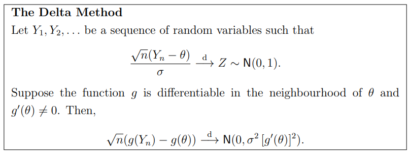

Power

Hypergeometric distribution - without replacement - trials not independent

Independent: $f(a|b)=f(a)$ for all $b$

Moment generating function of random variable sum = product of their moment generating functions

Convergence:

- Almost surely (strong law of large numbers) implies probability (weak law of large numbers) implies distribution
- Convergences in $L^p$ implies converges in probability

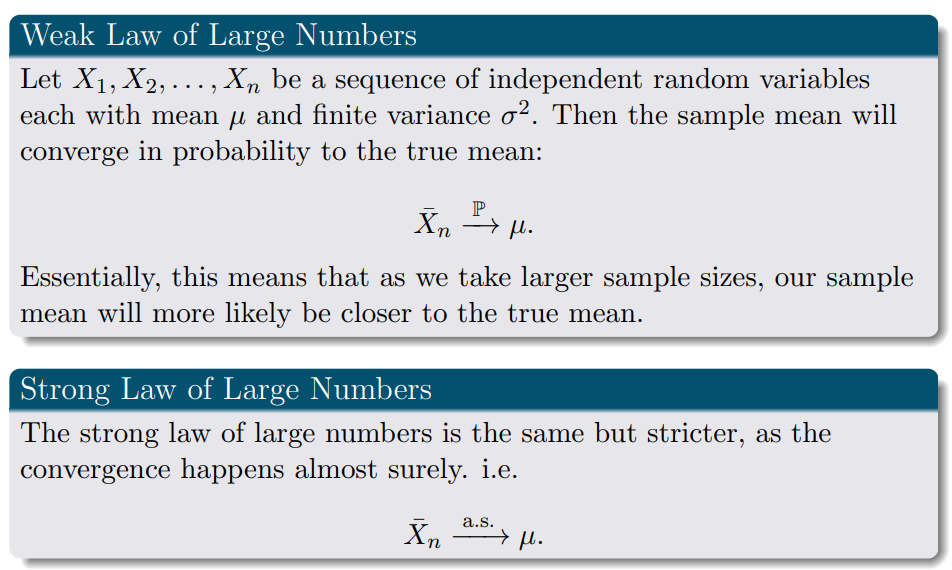

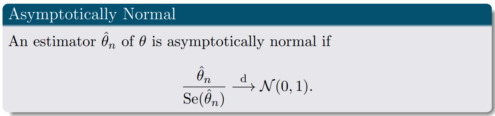

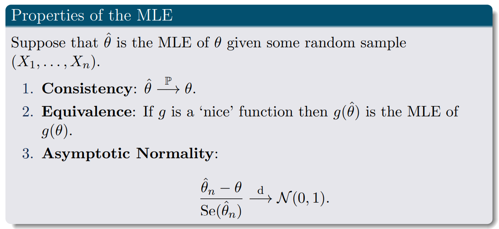

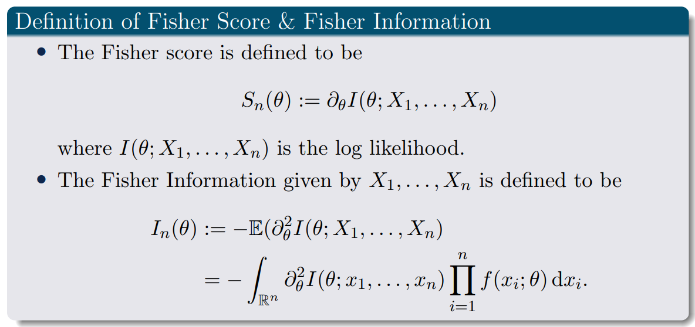

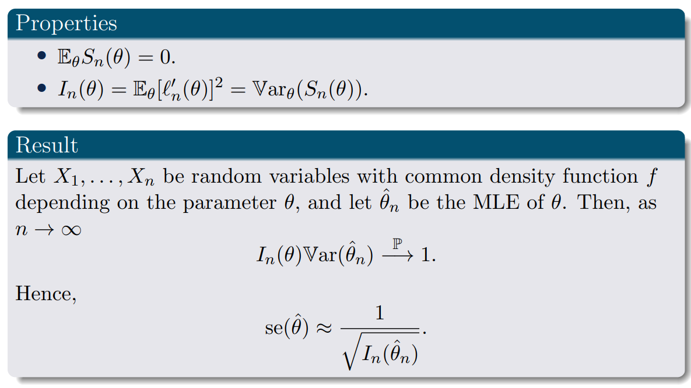

Confidence interval distribution:

1. If they give you the population variance, and they want an EXACT confidence interval for the MEAN, then use the normal distribution.
2. If they give you the sample variance, and they want an EXACT confidence interval for the MEAN, then use the t distribution with n-1 degrees of freedom.
3. If they give you a maximum likelihood estimator, and they want an APPROXIMATE confidence interval, use a Wald confidence interval (which is a z-dist aka normal dist).
4. If they want to find a confidence interval for a proportion in a binomial and they want an APPROXIMATE confidence interval, use the central limit theorem approximation of the binomial (which is a z-dist).

Confidence intervals for two normal random samples

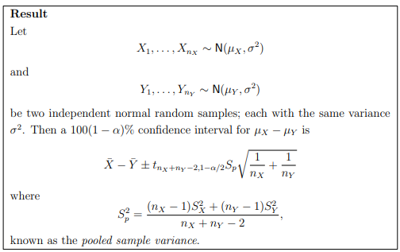

Confidence intervals for sample proportions

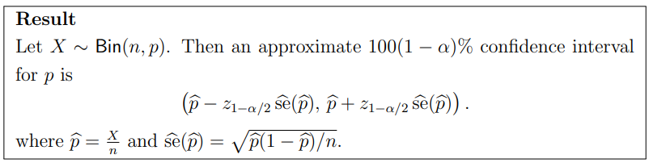

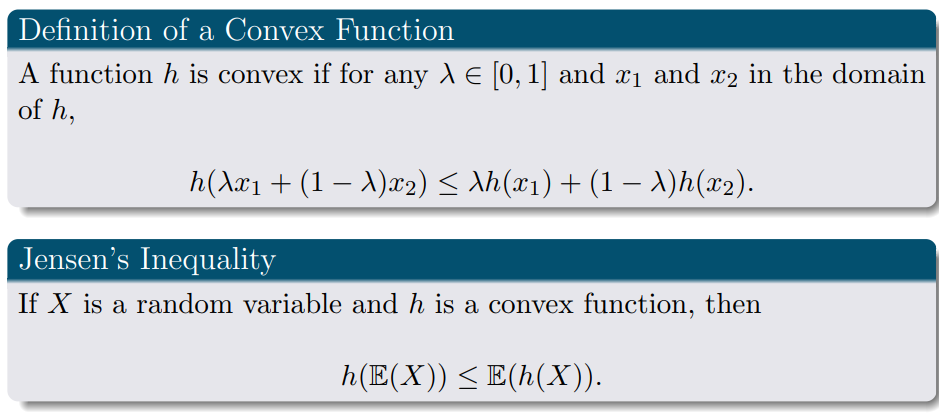

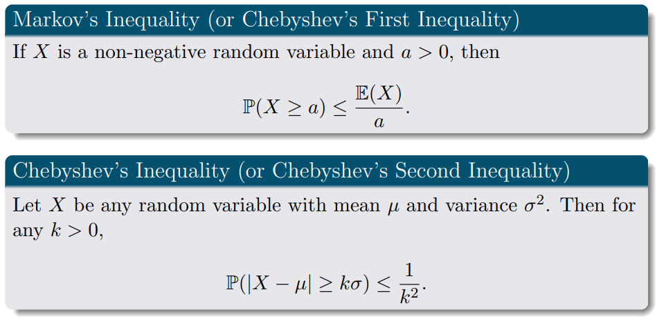

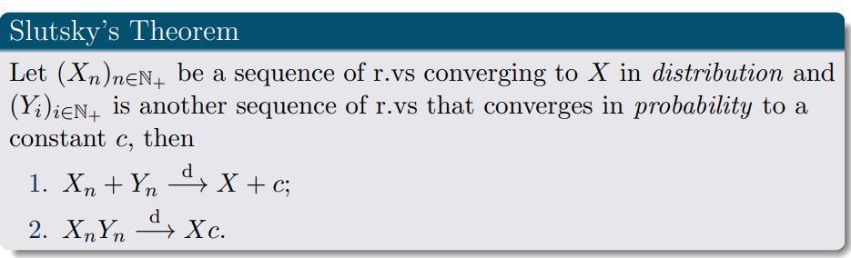

R: rejection region

Type 1 error (false positive): $P(X \in R | H_0 is true)$

Type 2 error (false negative): $P(X \in R | H_0 is false)$

Power function of a hypothesis test is $\beta(\theta) = P(X \in R)$ = type1error + type2error

Test statistic 

Transformation

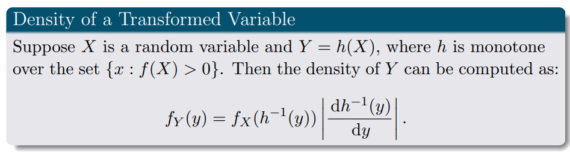

Bivariate transformation

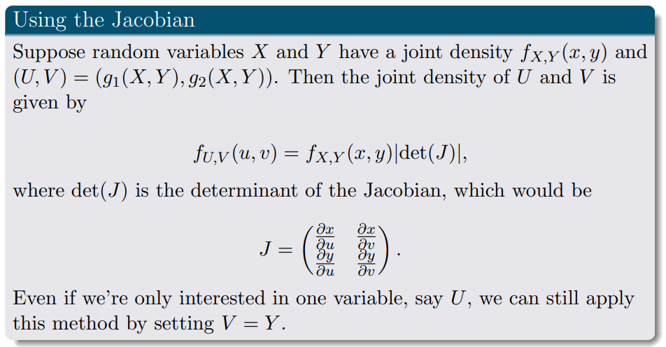

Likelihood function - not all differentiable or even continuous over theta

